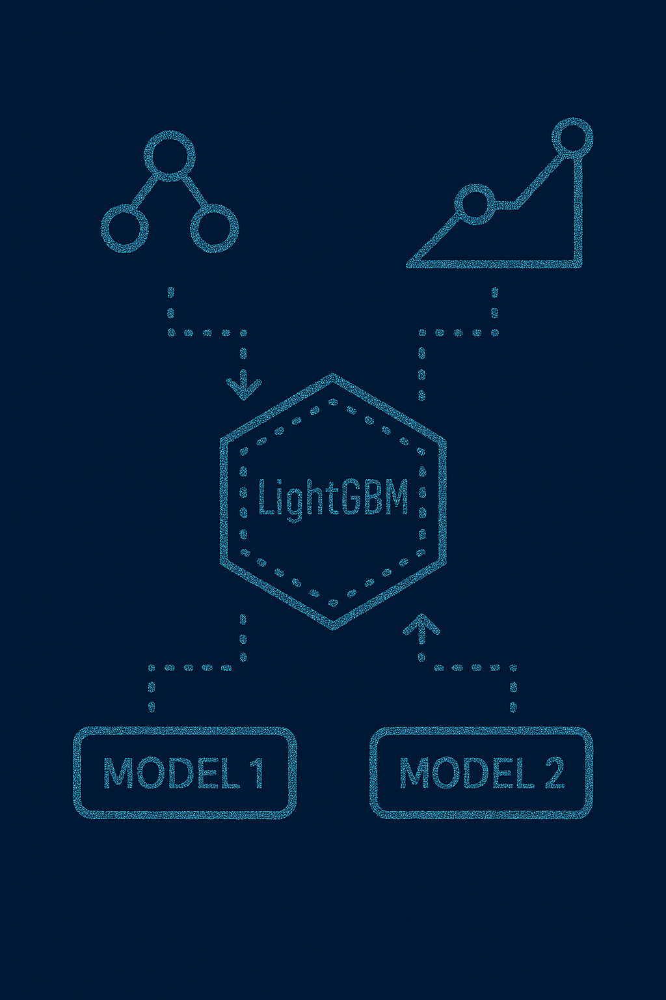

# 🌟 Model Fusion using LightGBM



This project explores **model fusion (stacking/blending)** techniques for predictive modeling, using **LightGBM** as the meta-learner.  
By combining multiple base models (ML classifiers and ensembles), the project demonstrates how stacking can improve performance over individual models.  

---

## 📂 Project Structure
- `DF3.csv` — dataset used for training and evaluation  
- `Model Fusion using LightGBM.ipynb` — main notebook with model fusion and LightGBM experiments  
- `README.md` — project documentation (this file)  

---

## 🚀 Getting Started

### 1. Clone the Repository
```bash
git clone https://github.com/your-username/model-fusion-lightgbm.git
cd model-fusion-lightgbm
```

### 2. Install Dependencies

We recommend Python 3.9+. Install requirements with:
```bash
pip install -r requirements.txt
```

### 3. Run the Notebook

Start Jupyter Notebook:
```bash
jupyter notebook
```

Open Model Fusion using LightGBM.ipynb and run the cells.
---
## 🧪 Methodology
### 🔹 Data Preprocessing

- Handle missing values

- Encode categorical features

- Normalize/standardize numeric features

- Handle class imbalance (if present)

### 🔹 Base Models Implemented

- Logistic Regression

- Decision Tree

- Random Forest

- Naive Bayes

- Support Vector Machine (SVM)

- K-Nearest Neighbors (KNN)

### 🔹 Model Fusion (Stacking)

- Train multiple base models

- Use LightGBM as a meta-learner to combine predictions

- Compare fused model performance with individual models

### 🔹 Evaluation Metrics

- Accuracy

- Precision

- Recall

- F1-score

- ROC-AUC
---
## 📊 Results

- Base models achieve varying levels of accuracy

- Fusion via LightGBM meta-learner improves generalization

- Demonstrates benefits of stacking/ensemble learning over single models
---
## 🤝 Contributing

Contributions are welcome!
To contribute:
```bash
git checkout -b feature/my-feature
# make changes
git commit -m "Add experiment: LightGBM fusion with tuned base models"
git push origin feature/my-feature
```

Then open a Pull Request.
---
## 📜 License

This project is released under the MIT License.
